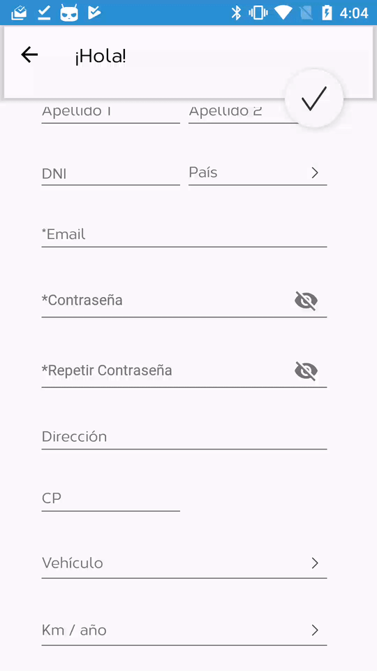

### List

#### Basic functionality
Click funtionality:
- Multi click (It can select various options in the list)
- Mono click (This mode support only one selection)

  [

```java
class ExampleListFragment : BaseV2RecycleViewFragment() {
    override fun getEmptyDrawable(): Drawable? {
      //Show when the  recycleview is empty
        return ContextCompat.getDrawable(context!!,R.drawable.ic_error)
    }

    override fun onViewCreated(view: View, savedInstanceState: Bundle?) {
        adapter = ExampleAdapter()
        super.onViewCreated(view, savedInstanceState)
    }

    companion object {

        fun instance(
                modelV2List: java.util.ArrayList<NoImageModelV2>,
                multiSet: Boolean, typeList: Int): ExampleAdapter {

            val selectableFragment = ListSelectableFragmentV2()

            val bundle = Bundle()

            bundle.putSerializable(KEY_MODEL_LIST, modelV2List)
            //if multiset is disabled when the user is click the data
            bundle.putBoolean(KEY_MULTISET,multiSet)
            bundle.putInt(KEY_TYPE_LIST, typeList)

            selectableFragment.arguments = bundle

            return selectableFragment
        }
    }

}
```

```java
public class ExampleAdapter extends BaseAdapterV2 {
    @Override
    public BaseAdapterViewHolderV2 onCreateViewHolder(ViewGroup parent, int viewType) {
        View itemView = LayoutInflater.from(parent.getContext())
        //This layout is for expample. Create your own
                .inflate(R.layout.no_image_holder,parent,false);
        return new ExampleViewHolder(itemView);
    }

    private class ExampleViewHolder extends BaseAdapterViewHolderV2 {

        BaturaTextView baturaTextView;
        AppCompatImageView tick_image;

        NoImageViewHolder(View itemView) {
            super(itemView);
        }

        /**
        *   This method is used for use views of the methods
        *
        **/
        @Override
        public void setupView(View view) {
            tick_image = view.findViewById(R.id.nih_tick);
            baturaTextView = view.findViewById(R.id.nih_text);

            view.findViewById(R.id.nih_container).setOnClickListener(new View.OnClickListener() {
                @Override
                public void onClick(View v) {
                    NoImageViewHolder.this.onClick(v);
                }
            });

        }

        /**
        * This method is called when the data is need to refreshed
        *
        **/
        @Override
        public void refreshView() {
            baturaTextView.setText(getItemModelV2().getText());

            //The element is selected and you change the status of  status of the cell
            if (getItemModelV2().getSelected()){
                tick_image.setVisibility(View.VISIBLE);
                baturaTextView.setTextColor(ContextCompat.getColor(getContext(), R.color.blue));
            }else{
                tick_image.setVisibility(View.INVISIBLE);
                baturaTextView.setTextColor(ContextCompat.getColor(getContext(),android.R.color.black));
            }
        }
    }
}

```

```java
public class ExampleListActivity extends AppCompatActivity {

    public static final String KEY_MODEL_LIST = "modelV2List";
    public static final String KEY_MULTISELECT = "multiset";
    public static final String KEY_TITLE = "titleKey";

    ArrayList<NoImageModelV2> modelList;
    String titleText;
    boolean multiSet;


    public void onCreate(Bundle savedInstance ){
        super.onCreate(savedInstance);
        setContentView(R.layout.default_list_activity);

        toolbar = findViewById(R.id.toolbar);

        modelList = (ArrayList<NoImageModelV2>) getIntent().getSerializableExtra(KEY_MODEL_LIST);
        titleText = getIntent().getStringExtra(KEY_TITLE);
        multiSet = getIntent().getBooleanExtra(KEY_MULTISELECT,false);


        setSupportActionBar(toolbar);
        getSupportActionBar().setDisplayHomeAsUpEnabled(true);
        Typeface typeface = ResourcesCompat.getFont(this,R.font.playfair_display_bold);
        DesignUtilsKt.changeToolbarFont(toolbar,typeface);

        setupViews();
    }

    @Override
    protected void onResume() {
        super.onResume();
        FirebaseAnalytics.getInstance(this).setCurrentScreen(this,titleText,"ListNoImageActivity");
    }

    public void setupViews(){

        ExampleListFragment listSelectableFragment =
                ExampleListFragment.Companion.instance(modelList,multiSet,NO_IMAGE_ADAPTER);

        getSupportFragmentManager().beginTransaction()
                .replace(com.baturamobile.mvp.R.id.container,listSelectableFragment).commit();

        setSupportActionBar(toolbar);

    }

}

```
A brief example who to launch the example activity

```java
fun launchExample(exampleSelectedModel: ExampleModel?){
        val intent = Intent(activity, ListNoImageActivity::class.java)

        val  exampleModelsList= UserUtils.createListWithExampleModel(exampleSelectedModel)

        intent.putExtra(ExampleListActivity.KEY_TITLE, activity.getString(R.string.example))
        intent.putExtra(ExampleListActivity.KEY_MODEL_LIST, exampleModelsList)
        intent.putExtra(ExampleListActivity.KEY_MULTISELECT, false)
        activity.startActivityForResult(intent, SELECT_EXAMPLE_REQUEST_CODE)

    }
  ```
 This model included you will need the info  to show correctly the holder
  ```java    
    class CountryListModelV2(val name : String, selected: Boolean, val countryCode : String): NoImageModelV2(selected){
        override fun getText(): String {
            return name
        }

        override fun getImageUri(): String {
            TODO("not implemented")
        }
    }
```
In the origin activity when you extract the data from the intent you received a list of Model you included
before, that will be selected or not
```java    
override fun onActivityResult(requestCode: Int, resultCode: Int, data: Intent?) {
        super.onActivityResult(requestCode, resultCode, data)
        if (requestCode == SELECT_EXAMPLE_REQUEST_CODE && resultCode == RESULT_OK){
          val exampleList= data!!.getSerializableExtra(KEY_MODEL_SELECTED) as ArrayList<ExampleModel>

        }
    }
```
